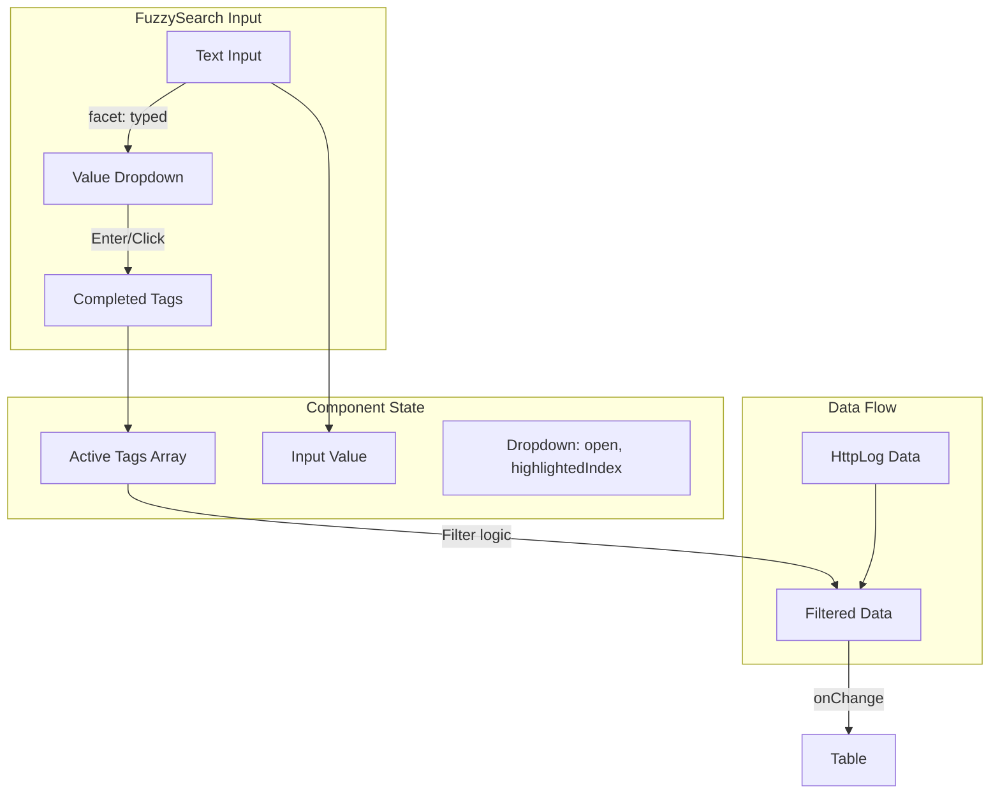

# Fuzzy Search Component Implementation Plan

Implement a DataDog-style fuzzy search input component in [src/FuzzySearch.tsx](src/FuzzySearch.tsx) that supports facet:value autocomplete, keyboard/mouse selection, tag completion, and table filtering. The component will replace the placeholder and integrate with the existing Table and HttpLog data.

## Current State

- **Template**: Vite + React + TypeScript + Tailwind + Moonshine Table
- **Data model**: `HttpLog` with facets: `method`, `path`, `statusCode`, `domain`, `id` ([src/types.ts](src/types.ts))
- **Sample data**: 12 logs with varied method, path, statusCode, domain ([src/data.ts](src/data.ts))
- **App flow**: `FuzzySearch` receives `data` and `onChange`; Table displays filtered data ([src/App.tsx](src/App.tsx))
- **FuzzySearch**: Placeholder only ([src/FuzzySearch.tsx](src/FuzzySearch.tsx))

## Architecture Overview



## Implementation Plan

### 1. Define Facet Configuration

Create a facet registry that maps facet names to:

- Display label (e.g., `statusCode` → "Status")
- Value extractor: `(log: HttpLog) => string | number`
- Optional: alias (e.g., `status` → `statusCode`)

**Facets from HttpLog**: `method`, `path`, `statusCode`, `domain`. Exclude `id` (not useful for filtering). Add `status` as alias for `statusCode` for spec alignment.

### 2. Build the FuzzySearch Component Structure

**Layout** (DataDog-style):

- Container: flex wrap, border, rounded, dark/light theme
- **Tags area**: Rendered tags as removable pills (backspace on last tag removes it)
- **Input**: Inline, grows to fill space, no visible border when focused
- **Dropdown**: Absolutely positioned below input, appears when in "value mode"

**State**:

- `tags: Array<{ facet: string; value: string }>` — completed filters
- `inputValue: string` — current text (e.g., `"service:"` or `"service:ex"`)
- `dropdownOpen: boolean`
- `highlightedIndex: number` — for keyboard navigation

### 3. Parsing Logic: Detect "Value Mode"

When user types, parse `inputValue`:

- Match pattern: `(facetName):(optionalValuePrefix)`
- If `facetName` matches a known facet and ends with `:`, we are in value mode
- Extract `valuePrefix` for filtering the dropdown list (optional fuzzy/filter)

**Example**: `method:` → show all methods; `domain:ex` → show domains starting with "ex" (e.g., example.com)

### 4. Dropdown Behavior

- **When to show**: `facet:` detected and facet is valid
- **Data source**: `[...new Set(data.map(extractor))]` filtered by `valuePrefix` (case-insensitive substring match)
- **Keyboard**: `ArrowDown` / `ArrowUp` to change `highlightedIndex`, wrap at edges
- **Selection**: `Enter` or click → add tag, clear input, close dropdown
- **Escape**: Close dropdown, optionally clear input
- **Click outside**: Close dropdown

### 5. Tag Completion and Display

- On select: append `{ facet, value }` to `tags`, set `inputValue = ""`, close dropdown
- Render tags as pills with `facet:value` and an optional remove (×) button
- **Backspace** on empty input: remove last tag

### 6. Filtering Logic

Filter `data` by tags:

- Each tag: `log[facet] === value` (or `String(log[facet]) === value` for statusCode)
- Combine with AND: all tags must match

```ts
const filtered = data.filter(log =>
  tags.every(({ facet, value }) => {
    const key = facet === 'status' ? 'statusCode' : facet;
    return String(log[key as keyof HttpLog]) === value;
  })
);
```

Call `onChange(filtered)` whenever `tags` change.

### 7. Accessibility and UX

- **Keyboard**: Full support (arrows, Enter, Escape, Backspace)
- **ARIA**: `role="combobox"`, `aria-expanded`, `aria-activedescendant`, `aria-controls`
- **Focus**: Keep focus in input; dropdown items focusable via `aria-activedescendant` pattern
- **Screen readers**: Announce selected value and dropdown state

### 8. Styling (Tailwind)

- Dark theme similar to DataDog: `bg-zinc-900`, `border-zinc-700`, `text-zinc-100`
- Tags: `bg-blue-600/80`, `rounded`, `px-2 py-0.5`, remove button on hover
- Dropdown: `bg-zinc-800`, `border`, `shadow-lg`, max-height with scroll
- Highlighted row: `bg-zinc-700` or `bg-blue-600/30`
- Focus ring for accessibility

### 9. Production Considerations (README / Comments)

Document in README or code comments:

- **Client-side vs server**: Current impl filters in memory; production would typically:
  - Send tags to backend API; backend filters/paginates
  - Use debounced requests for facet value suggestions (e.g., typeahead API)
- **Scale**: For millions of logs, facet values would come from an index/aggregation, not full scan
- **Virtualization**: If dropdown has thousands of values, use `react-window` or similar (optional enhancement)
- **Fuzzy matching**: Could add `fuse.js` or similar for typo-tolerant value search

## File Changes

| File | Changes |
|------|---------|
| [src/FuzzySearch.tsx](src/FuzzySearch.tsx) | Full implementation: facet config, parsing, dropdown, tags, filtering, keyboard handlers |
| [src/App.tsx](src/App.tsx) | Pass `sampleData` to FuzzySearch for filtering; ensure `onChange` receives filtered data (already correct) |
| [src/types.ts](src/types.ts) | Optional: export `FacetTag` type if used elsewhere |
| [README.md](README.md) | Add AI usage note if applicable; brief usage/production notes |

## Optional Enhancements (if time permits)

- Facet name autocomplete when user types before `:`
- Fuzzy matching on values (e.g., `fuse.js`)
- Virtualized dropdown for large value sets
- Loading state for async facet values (demonstrate production pattern)

## Testing Checklist

- Type `method:` → dropdown shows GET, POST, PUT, DELETE, PATCH
- Type `domain:ex` → dropdown shows example.com
- Arrow keys highlight; Enter selects
- Click on value selects and adds tag
- Multiple tags filter with AND
- Backspace on empty input removes last tag
- Escape closes dropdown
- Table updates when tags change
